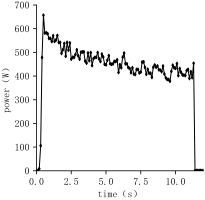
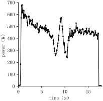

# The UAV Energy Consumption Hirearchy

The UAV motor is drawing power dramatically and fluctuatingly. Additionally, as we examine the UAV energy comsumption hierarchy, the motor takes up a large portion in hardware power consumption. Due to these reasons, it is hard to optimize hardware to reduce energy cost. Therefore, we intend to improve task scheduling system with reinforcement learning, which on-board computer is able to support, to optimize the power consumption.

To acquire a knowledge of the energy consumption composition of a single UAV, we survey several UAVs on the market and listed their power in the table below:

Table 1 Key Hardware Composition and Working Energy Consumption of Single UAV

|   Key hardware    |                              Model case                               |          Power (W)          |
| :---------------: | :-------------------------------------------------------------------: | :-------------------------: |
|       Motor       | T-MOTOR F40PRO IV 2400 (T5150 three blade propeller is used together) | 255.88 (65% throttle point) |
| On-board computer |                         DJI Magic 2-C (256G)                          |           5 - 60            |
|      Camera       |                         Intel RealSense D435i                         |             1.5             |

In most scenarios, the throttle point of the UAV is maintained at around 65%, and there are four motors in a UAV, consuming the most part of the energy. We do a survey on motors in the dimension of physics and a real-world UAV flight test. The data of the energy consumption of T-MOTOR F40PROI IV 2400 with T5150 Tri-Blade Propeller in height-fixed mode and manual mode is illustrated in Figure 1.

Figure 1a: Height-Fixed Mode

Figure 1b: Manual Mode

In height-fixed mode, UAV automatically decide its next move; In manual mode, the next move is controlled by hand. From Figure 1 and Table 1, we can conclude that: the motor is draning the most part of the energy consumption, and the motor energy drainage is varying dramatically. Apart from that, the motor scheduling is usually static. Therefore, it is diffcult to lower the consumption through controlling motors and hardware scheduling.

Another energy-consuming part of the UAV is the onboard computer. When the computing load hits a peak, the energy consumption also presents a spike. Overall, to optimize the energy consumption, we shall take the consumption of the onboard computer seriously.
